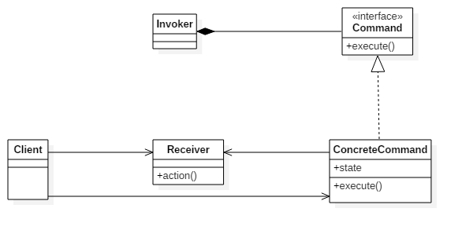

<!-- more -->

## 应用场景

### 多级撤销
### 原子事务行为
### 状态条
### 导航
### GUI按钮与菜单条
### 线程池

## 参考链接

- [Command pattern](https://en.wikipedia.org/wiki/Command_pattern)
- [命令模式应用场景](http://blog.csdn.net/zdsicecoco/article/details/51332440)